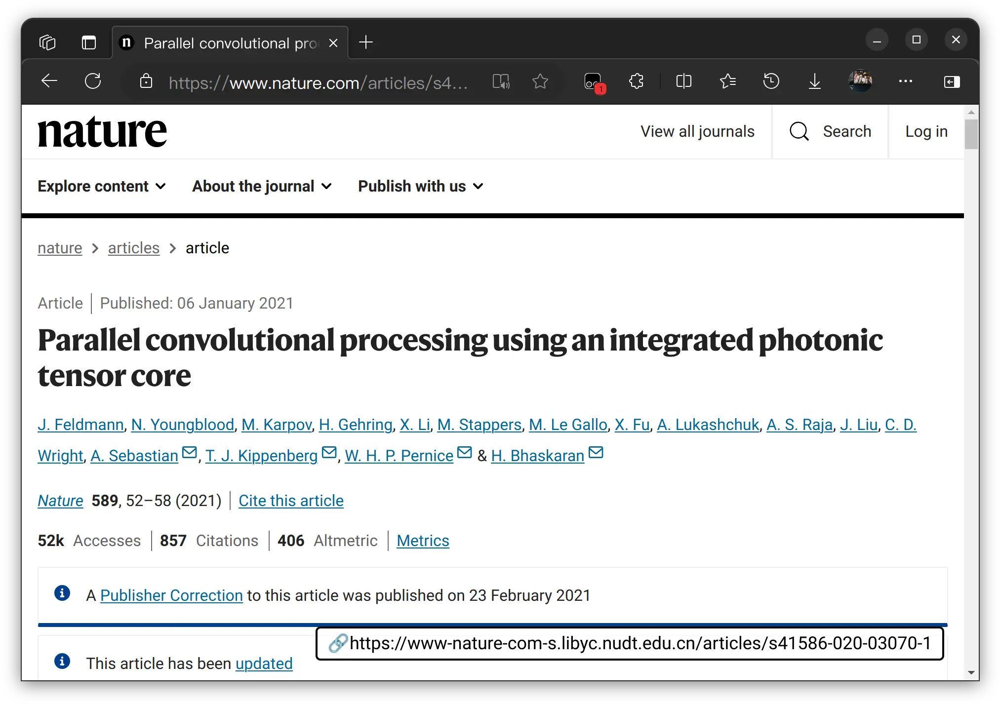

# 四方坪职院学术重定向

💓 from Sifangping Polytechnic College | [github repo](https://github.com/cyan-io/SPC-Academic-Redirection/issues)

## 原理

根据图书馆接口规则，根据URL跳转至包库，在非校园网环境下快速访问学术资源，2024年9月测试有效。当前支持的学术资源：

- https://ieeexplore.ieee.org/
- https://dl.acm.org/
- https://auth.elsevier.com/
- https://www.sciencedirect.com/
- https://www.emerald.com/
- https://ieeexplore.ieee.org/
- https://www.webofknowledge.com/
- https://bg.sunwayinfo.com.cn/
- https://arxiv.org/
- https://navi.ion.org/
- https://thesis.library.caltech.edu/
- https://www.nature.com/

查漏补缺，请提[issue](https://github.com/cyan-io/SPC-Academic-Redirection/issues)。

## 安装

需要浏览器安装[油猴](https://www.tampermonkey.net/)扩展，在[greasyfork](https://greasyfork.org/)中搜索“四方坪职院学术重定向”，或直接使用[链接](https://greasyfork.org/zh-CN/scripts/509010-%E5%9B%9B%E6%96%B9%E5%9D%AA%E8%81%8C%E9%99%A2%E5%AD%A6%E6%9C%AF%E9%87%8D%E5%AE%9A%E5%90%91)。

测试：https://www.nature.com/articles/s41586-020-03070-1

## 注意

访问包库需要图书馆账户，请勿做无用功。

